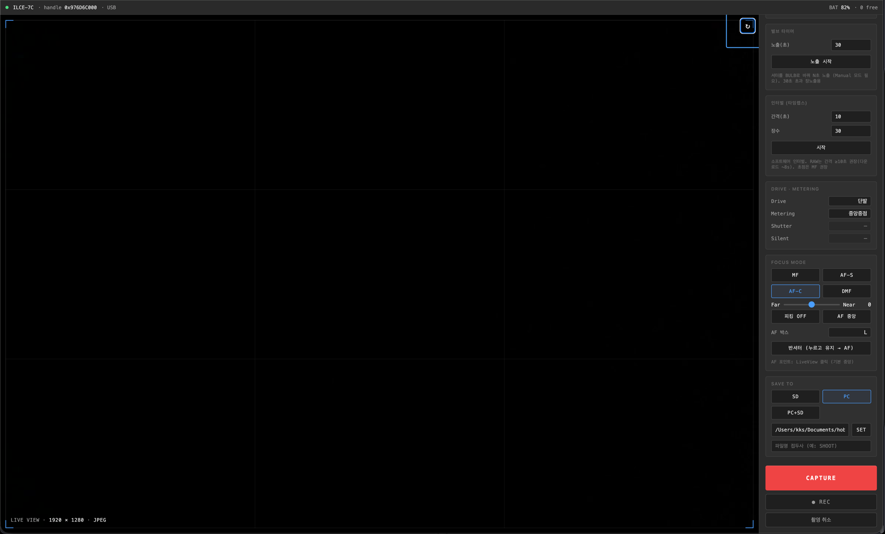
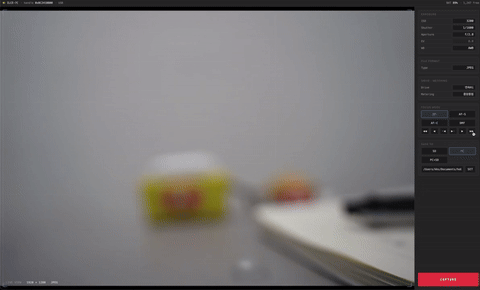
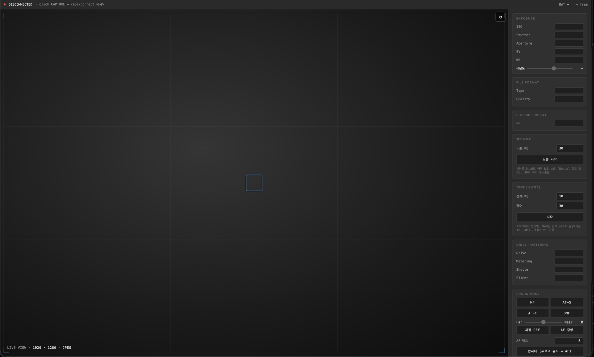
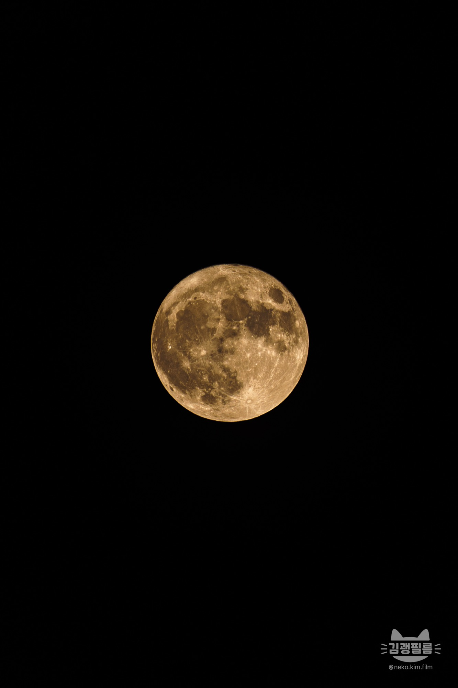

# CRSDK Camera Server

*[English README](README.md)*

**Sony Camera Remote SDK**의 Rust FFI 래퍼 + 브라우저 기반 **테더링 서버**(단일 페이지 웹 UI).
폰·PC 브라우저에서 노출·포커스·촬영·라이브뷰·장노출/타임랩스를 원격 제어합니다.

> ### ⚠️ 대상 기기: Sony A7C (ILCE-7C) 전용
> **ILCE-7C 한 대로만** macOS(Apple Silicon)·USB에서 개발·검증했습니다. 다른 바디는 미검증이며,
> A7C가 노출하지 않는 기능(자이로 레벨·Creative Look·벌브 타이머·AF영역 device property 등)은
> 코드에 남아 있어도 이 바디에선 동작하지 않습니다. 멀티바디 지원은 향후 과제입니다.

## 기능

- **라이브뷰** — MJPEG + 포커스 피킹, RGB 히스토그램, 3분할 그리드 토글(뷰와 함께 회전), 수동 회전
- **노출·색** — ISO·셔터·조리개·EV·화이트밸런스(+켈빈 슬라이더)·측광·드라이브·플래시모드·파일포맷·JPEG품질·Picture Profile
- **포커스** — MF Near/Far 슬라이더, 라이브뷰 클릭 AF 포인트(Y축 보정·회전 인식), AF 영역 모드(와이드/존/중앙/플렉서블 S·M·L/트래킹), 반셔터(S1) + 합초 표시
- **촬영** — 단발·연사(누르고 유지)·동영상·취소
- **장노출** — 고정 1″–30″, BULB, **소프트웨어 벌브 타이머**(1–900초)
- **타임랩스** — 소프트웨어 인터벌(장수 × 간격) + 취소
- **저장** — PC 저장(폴더·접두사), 촬영 미리보기, 배터리·남은 컷
- **멀티바디 대비** — 바디가 보고하는 capability로 컨트롤을 큐레이션(미노출 속성은 자동 숨김)
- **안정성** — 자동 재연결, graceful shutdown(카메라 세션 클린 해제)

## 스크린샷

단일 페이지 **Tether Console** — 왼쪽은 포커스 피킹·3분할 그리드가 얹힌 라이브뷰,
오른쪽은 모든 컨트롤.

| 연결됨 | 라이브뷰 (AF) |
|---|---|
|  |  |



## 아키텍처

```
Sony C++ SDK ──► wrapper/wrapper.{h,cpp}  (pure-C shim, SCRSDK 네임스페이스 브리지)
                     └─► build.rs (cc + bindgen) ─► src/ffi.rs
                            └─► safe Rust lib: session / enumerate / connection /
                                liveview / shutter / control / properties / callback / error
                                   └─► crsdk_server (axum/tokio) + crsdk_server/web/index.html
```

모든 SDK 호출은 `spawn_blocking`으로 격리, 카메라는 `Arc<Mutex<…>>` 뒤에 둡니다.

## 빌드

**Sony SDK는 이 저장소에 미포함**(아래 *라이선스* 참조)입니다. 직접 받아 프로젝트 루트에
`CrSDK_v2.01.00_20260203a_Mac/`로 배치하세요.

```bash
# 전제: Rust, LLVM/Clang (brew install llvm)
export DYLD_LIBRARY_PATH=$DYLD_LIBRARY_PATH:$(pwd)/CrSDK_v2.01.00_20260203a_Mac/RemoteCli/external/crsdk/

cargo run -p crsdk_server        # → http://localhost:8080/web/index.html
```

macOS의 `ptpcamerad`가 USB 카메라 접근을 방해하므로 서버가 부팅 시 억제합니다(정상 동작).

## 배포 (바이너리 .app)

Sony 라이선스는 SDK 라이브러리를 **앱 안에 동봉해** 배포하는 것을 허용합니다.
`scripts/make_app.sh`가 SDK 라이브러리를 `Contents/Frameworks/`에 담은 자급식 macOS 앱
번들(`dist/A7C Tether.app`)을 만듭니다:

```bash
./scripts/make_app.sh
```

미리 빌드된 배포본은 [Releases](../../releases)에 있습니다. 첫 실행: 우클릭 → 열기,
또는 `xattr -dr com.apple.quarantine "A7C Tether.app"`.

## 🌙 첫 작품

이 툴로 찍은 첫 사진 — ILCE-7C + FE 100-400 GM, 무보정.



> © neko.kim.film (김괭필름)

## 후원

도움이 되셨다면 ☕

[](https://ctee.kr/place/sdlfactory)

## 라이선스

이 저장소의 소스코드는 **MIT 라이선스**([LICENSE](LICENSE)).

**Sony Camera Remote SDK는 미포함**이며 **저작권은 Sony**에 있습니다.
[Sony Developer World](https://www.sony.net/CameraRemoteSDK/)에서 받아
[라이선스 계약](https://support.d-imaging.sony.co.jp/app/sdk/licenseagreement/ja.html)에
동의해야 합니다. 본 프로젝트는 Sony와 무관한 독립·비공식 프로젝트입니다.
