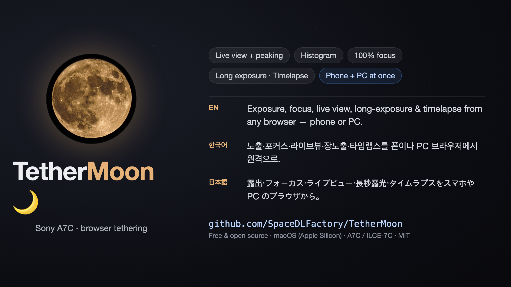

# TetherMoon 🌙



*[한국어 README](README.ko.md) · [日本語 README](README.ja.md)*

A Rust FFI wrapper for the **Sony Camera Remote SDK** plus a browser-based
**tethering server** with a single-page web UI. Control exposure, focus, capture,
live view, and long-exposure/timelapse from any browser on your phone or PC.

> ### ⚠️ Target device: Sony A7C (ILCE-7C) only
> This tool was developed and tested with **a single body, the ILCE-7C**, over
> USB on macOS (Apple Silicon). Other bodies are untested. Features the A7C does
> not expose (gyro level, Creative Look, bulb timer, AF-area device properties,
> etc.) remain in the code but do not work on this body. Multi-body support is
> a future goal.

## Quick start — just use it

No building required. Grab the latest **[release](../../releases/latest)**.

### macOS

1. Download the `.dmg`, open it, and drag **TetherMoon** into Applications.
2. Launch it. First time only: right-click the app → **Open** → **Open**.
3. Connect your A7C by USB and set it to **PC Remote** (camera: MENU → USB →
   *USB Connection Mode* → *PC Remote*). The console opens in your browser.
4. To watch/control from a phone, open the LAN URL shown at the bottom of the
   page (phone must be on the same Wi-Fi).

### Windows

The Windows download is **portable and does not include the Sony SDK** (redistribution
licensing). You supply the SDK files once:

1. Download `TetherMoon-win-x64-portable.zip` and unzip it anywhere.
2. Get the **Windows** [Sony Camera Remote SDK](https://support.d-imaging.sony.co.jp/app/sdk/en/index.html),
   unzip `RemoteCli.zip`, and copy from `external\crsdk\` next to `crsdk_server.exe`:
   `Cr_Core.dll`, `monitor_protocol*.dll`, and the whole `CrAdapter\` folder.
3. Install the **libusbK driver** (one time): connect the A7C by USB with **PC Remote** on,
   then Device Manager → *ILCE-…* → **Update driver** → *Have Disk* → the SDK's
   `Driver.zip`→`srcameradriver.inf` → *Install anyway*.
4. Run `crsdk_server.exe`. The console opens in your browser; the phone LAN URL is printed.

> Details & troubleshooting: [`docs/WINDOWS-PORT.md`](docs/WINDOWS-PORT.md). Building the
> Windows app (and a full installer that auto-installs the driver) is covered under
> *Build → Windows* below.

The rest of this README is for **building from source**.

## Features

- **Live view** — MJPEG stream with focus peaking, RGB histogram, toggleable
  rule-of-thirds grid (rotates with the view), manual rotation
- **Exposure & color** — ISO, shutter, aperture, EV, white balance (+ Kelvin slider),
  metering, drive mode, flash mode, file format, JPEG quality, Picture Profile
- **Focus** — MF Near/Far slider, AF point by live-view click (Y-axis calibrated,
  rotation-aware), AF-area mode (Wide/Zone/Center/Flexible S·M·L/Tracking),
  half-shutter (S1) with focus-indication feedback
- **Capture** — single, burst (press-hold), movie record, cancel
- **Long exposure** — fixed 1″–30″, BULB, and a **software bulb timer** (1–900 s)
- **Timelapse** — software interval shooting (count × interval) with cancel
- **Save** — to PC with custom folder/prefix, capture preview, battery & shots-remaining
- **Multi-body ready** — controls are curated from each body's reported
  capabilities; properties a body does not expose are hidden automatically
- **Multiple viewers** — the live view fans out to any number of browsers
  (phone + desktop at once) from a single camera stream
- **Robust** — auto-reconnect, graceful shutdown (clean camera session release),
  opens your browser automatically on launch

## Screenshots

The single-page **Tether Console** — live view with focus peaking and a rule-of-thirds
grid on the left, all controls on the right.

| Connected | Live view (MF focus pull) |
|---|---|
|  |  |


## Architecture

```
Sony C++ SDK ──► wrapper/wrapper.{h,cpp}  (pure-C shim, SCRSDK namespace bridge)
                     └─► build.rs (cc + bindgen) ─► src/ffi.rs
                            └─► safe Rust lib: session / enumerate / connection /
                                liveview / shutter / control / properties / callback / error
                                   └─► crsdk_server (axum/tokio) + crsdk_server/web/index.html
```

All SDK calls run on `spawn_blocking`; the camera lives behind `Arc<Mutex<…>>`.

## Build

The **Sony SDK is not included** in this repository (see *License* below). Download
it yourself and place it at the project root as `CrSDK_v2.01.00_20260203a_Mac/`.

```bash
# Prerequisites: Rust, LLVM/Clang (brew install llvm)
export DYLD_LIBRARY_PATH=$DYLD_LIBRARY_PATH:$(pwd)/CrSDK_v2.01.00_20260203a_Mac/RemoteCli/external/crsdk/

cargo run -p crsdk_server        # → http://localhost:8080/web/index.html
```

macOS's `ptpcamerad` daemon interferes with USB camera access; the server suppresses
it on startup (this is expected behavior).

### Windows

Same codebase, cross-platform via `cfg`. Place the **Windows** SDK at the project root
as `CrSDK_Win/` (so headers are at `CrSDK_Win/app/CRSDK`, libs at `CrSDK_Win/external/crsdk`).

```bat
:: Prerequisites: Rust (msvc), VS Build Tools (MSVC + Windows SDK), LLVM
set "LIBCLANG_PATH=C:\Program Files\LLVM\bin"   :: quotes required (no trailing space)
cargo run -p crsdk_server                        :: → http://localhost:8080/web/index.html
```

`build.rs` copies `Cr_Core.dll` + `CrAdapter\*.dll` next to the exe automatically (no rpath
on Windows). The strings returned by the Windows DLL are UTF-16 and converted to UTF-8 in
the FFI wrapper.

> **One-time driver step (required):** Windows binds the camera to the generic MTP driver,
> which the SDK's libusb cannot claim. Install Sony's bundled **libusbK** driver
> (`Driver.zip` → `srcameradriver.inf`) via Device Manager → *Update driver* → *Have Disk*
> → *Install anyway*, with the camera in **PC Remote** USB mode. Without it the server
> reports `no cameras detected`. See [`docs/WINDOWS-PORT.md`](docs/WINDOWS-PORT.md) §2.7.

## Distribution (binary .app)

The Sony license permits distributing the SDK library **embedded inside your
application**. `scripts/make_app.sh` packages a self-contained macOS app bundle
(`dist/TetherMoon.app`) with the SDK libraries inside `Contents/Frameworks/`:

```bash
./scripts/make_app.sh
```

Pre-built releases are attached to the [Releases](../../releases) page. First launch:
right-click → Open, or `xattr -dr com.apple.quarantine "TetherMoon.app"`.

On **Windows**, build a one-click installer (`dist/TetherMoon-setup.exe`) that bundles
the app and **auto-installs the libusbK driver** (no manual Device Manager step) via
[Inno Setup](https://jrsoftware.org/isinfo.php):

```bat
set "LIBCLANG_PATH=C:\Program Files\LLVM\bin"
powershell -ExecutionPolicy Bypass -File scripts\package-win.ps1   :: stages files + zip
iscc scripts\installer.iss                                         :: → dist\TetherMoon-setup.exe
```

`package-win.ps1` alone also produces a portable `dist/TetherMoon-win-x64.zip`
(exe + SDK DLLs + `CrAdapter\` + `web\` + libusbK `driver\` + README) if you prefer
no installer.

## 🌙 First shot

Taken with this tool — ILCE-7C + FE 100-400 GM, straight out of camera.


> © neko.kim.film (김괭필름)

## Support

If this project is useful to you:

[](https://ctee.kr/place/sdlfactory)

## Contact

Questions, bug reports, or feedback: **spacedlfactory@gmail.com**

## License

The source code in this repository is **MIT licensed** ([LICENSE](LICENSE)).

The **Sony Camera Remote SDK is NOT included** and is **copyright Sony**. You must
download it from [Sony's Developer World](https://www.sony.net/CameraRemoteSDK/) and
agree to its
[License Agreement](https://support.d-imaging.sony.co.jp/app/sdk/licenseagreement/en.html).
This is an independent, unofficial project, not affiliated with or endorsed by Sony.
